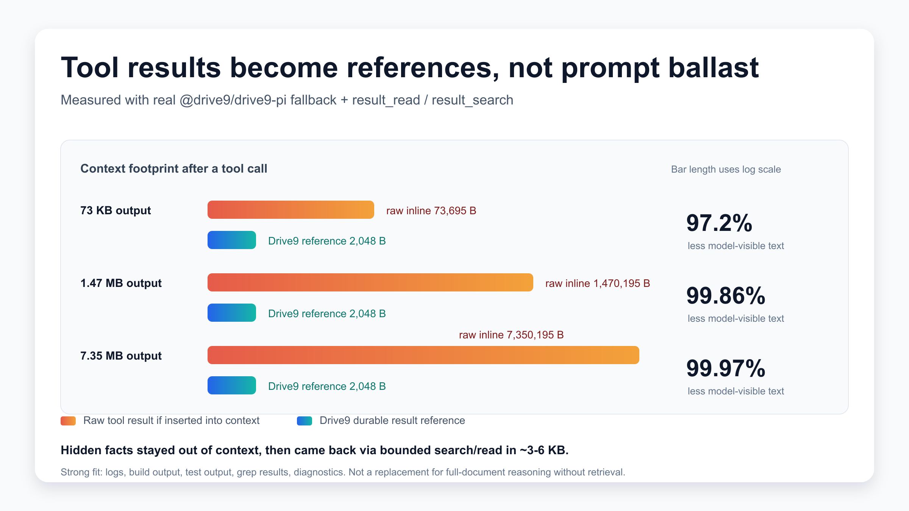
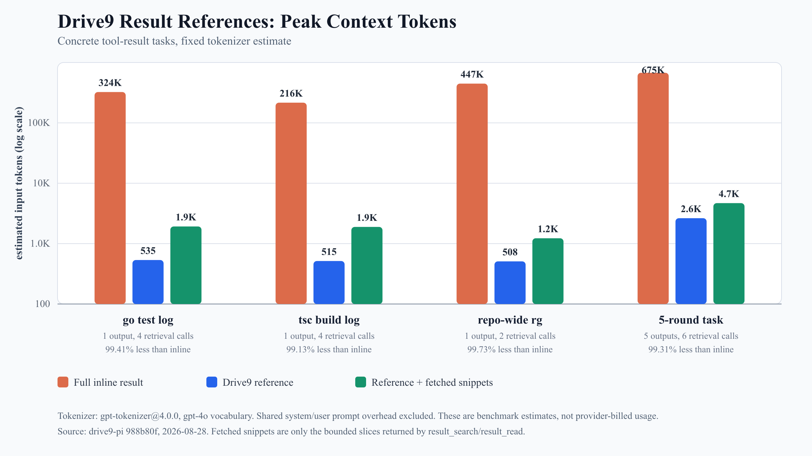
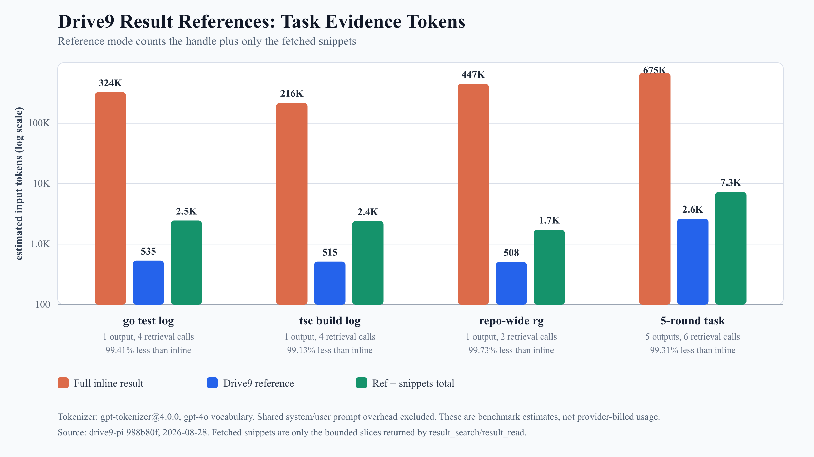

# 别把测试日志塞进上下文窗口

> Drive9 result reference 做的事很朴素：大工具输出留在证据库，模型上下文里只放一张可回读的引用卡。

一个 coding agent 修测试失败时，最常见的第一步是跑测试。

比如它执行 `go test ./...`。终端开始滚动：package 初始化日志、重试、warning、数据库连接信息、几百个通过的 case，最后夹着一个真正有用的失败。真正决定下一步的可能只有三行：

```text
FAIL: TestLayerCommitKeepsExternalWrite
expected conflict, got committed
main data overwritten by stale layer
```

但工具返回给 agent 的不是三行，而是一整份日志。几十 KB 还好，几 MB 就很快变成麻烦。下一轮模型要同时看任务、代码、diff、日志、计划和用户要求；如果把整份日志原样塞进去，上下文窗口就被一堆一次性文本占住了。

很多 agent 产品会在这里做截断。截断能让上下文干净一些，但它把问题换成了另一种形式：证据没了。错误行如果刚好在 preview 外，模型只能猜、靠摘要、或者重新跑命令。重新跑也不一定复现同一份输出，尤其是并发测试、远端服务、时间敏感任务。

这就是我们做 Drive9 Pi result reference 时想解决的场景。上下文窗口不应该承担日志仓库的职责。它应该放当前推理需要的东西；完整日志应该像工程证据一样被保存、搜索和引用。

## 一张引用卡

Drive9 Pi integration 现在有一个 `afterToolCall` fallback。工具执行完后，如果结果很小，它仍然原样进入上下文。如果结果超过阈值，并且模型可见内容全部是文本，它会把文本写入 Drive9 evidence store。

写入不是把一坨字符串随手丢进去。它会分块保存，再发布一个 manifest。发布成功后，下一轮模型看到的不是完整日志，而是一张 compact reference card，里面有：

- `resultId`；
- 总字节数和行数；
- 状态和 hash；
- 一小段 preview；
- 提示模型可以用 `result_search` 和 `result_read` 取回细节。

后面 agent 如果要找失败行，就调用 `result_search`。如果要看失败附近 80 行，就调用 `result_read`。被取回的小片段会进入上下文，完整原始文本仍留在证据库里。

这个边界很重要。模型不是“自动读懂了外部 7 MB 日志”。它只看见引用卡和后来主动取回的片段。换来的好处是，上下文不再被每一次大工具输出拖垮，而证据也没有因为截断而消失。

## 我们实际测了什么

这次测试分两层。

第一层是机制测试。脚本直接使用当前 `@drive9/drive9-pi` checkout 里的真实 adapter/store/read/search 逻辑：`createAfterToolCallFallback`、`PersistentToolResultStore`、`result_search`、`result_read`。为了让实验可离线复现，backend 用的是脚本里的 `MemoryBackend`，没有连真实 Drive9 server，也没有测网络延迟或服务端持久化性能。

第二层是场景化 token 测试。我们没有真的跑 `go test`、`tsc` 或 `rg`，而是用脚本生成形态接近这些输出的 synthetic fixtures：大量噪音行、少量关键 marker，而且 marker 故意放在 preview 外。这样可以稳定验证两件事：引用卡里没有偷带答案；后续 search/read 能把需要的片段找回来。

所以这组数据证明的是“引用化和检索机制能显著减少模型可见证据量”。它不是模型成功率 benchmark，也不是 provider 账单 benchmark。

机制测试的三档结果如下：

| Tool result | Inline context | Drive9 reference | Reduction |
| --- | ---: | ---: | ---: |
| 74 KB | 73,695 bytes | 2,048 bytes | 97.22% |
| 1.47 MB | 1,470,195 bytes | 2,048 bytes | 99.86% |
| 7.35 MB | 7,350,195 bytes | 2,048 bytes | 99.97% |



图里的 2 KB reference line 是 benchmark 显式配置的 `previewBytes: 2 * 1024`。包默认值更保守：`thresholdBytes` 是 50 KB，`previewBytes` 是 8 KB。

我们还看了一个多轮压力：连续 5 次工具输出，每次约 1.47 MB。全量 inline 时，光工具文本就会给后续会话带来约 7.35 MB 内容。引用模式下，五张 reference card 约 10 KB；再加上按需 `result_search` / `result_read` 取回的片段，总模型可见证据约 19 KB，减少约 99.74%。





token 图使用 `gpt-tokenizer@4.0.0` 的 `gpt-4o` vocabulary 估算。它适合比较两种路径的相对差异，但不等同于 API 返回的 `usage.input_tokens`。真正的成本测试应该固定模型、prompt、温度和任务，再记录多次真实调用的 usage。

## 为什么这对 agent 有用

一个真实工程任务很少只跑一次工具。agent 可能先跑全量测试，再跑单测，再搜调用点，再看构建输出，再读日志。每一步都可能产生很长的文本。

这些文本的共同特点是：需要保留完整证据，但当前决策只依赖其中几段。

测试日志里可能只要第一个失败 case。编译输出里可能只要最早的类型错误。repo-wide 搜索里可能只要两个函数定义和一个调用点。把整份结果全塞进上下文，看起来“信息更多”，实际常常只是噪音更多。

工程师平时不会这么工作。我们会保存日志文件，搜索关键字，跳到某一行，再把关键片段贴到当前分析里。Drive9 result reference 把这个工作流放进 agent loop：保存完整证据，给模型一张引用卡，需要时再按关键字和行号取回片段。

这不是摘要器。

摘要会提前判断什么重要，判断错了就丢证据。reference 不替你做这个决定。它先保留原始文本，再允许后续按任务需要查回来。未来当然可以在 evidence 上继续做分层摘要、结构化索引、失败分类；但底层前提应该先成立：原始证据还在，而且能被重新定位。

## 适合什么，不适合什么

适合它的场景很明确：

- 测试日志；
- 编译和构建输出；
- repo-wide `grep` / `rg`；
- 迁移 dry-run；
- 诊断报告；
- 多服务文本日志；
- 长列表、长 diff、长检查报告。

这些结果通常很大，但有用信息很稀疏。reference 让 agent 不必在“全塞进上下文”和“截断丢证据”之间二选一。

它不适合把长文档一次性读完并做全局综合。如果任务真的要求模型同时比较每一段内容，还是需要专门的分块摘要、map-reduce 或索引流程。

它也不是二进制、图片、视频的通用答案。这些内容需要对应的抽取和索引。

还有一个工程边界：当前 fallback 是工具结果 materialize 之后再兜底落库。对于会持续输出很久、体积很大的工具，更好的方式是工具直接流式写入 `ToolResultStore`，而不是先把完整结果攒在内存里。

## 今天谁可以用

今天最准确的说法是：SDK 集成方可以直接用，普通 Pi 用户的一键 evidence mode 还需要下一个 extension 入口。

如果你已经在自己的应用里创建 Pi `Agent`，接入点就是初始化 `AgentOptions` 的地方：

```bash
npm install @drive9/drive9-pi drive9
```

完整可复制示例在本目录的 `sdk-integrator-quickstart.md`。核心代码形态是：

```ts
import { Agent } from "@earendil-works/pi-agent-core";
import {
  createDrive9PiIntegration,
  verifyEvidenceIsolation,
} from "@drive9/drive9-pi";

await verifyEvidenceIsolation({
  workspaceRemoteRoot,
  evidenceRemoteRoot,
  workspaceClient,
  evidenceClient,
});

const drive9 = createDrive9PiIntegration({
  workspaceClient,
  workspaceRoot: workspaceRemoteRoot,
  evidenceClient,
  evidenceRoot: evidenceRemoteRoot,
  sessionId,
  runId,
});

const agent = new Agent(
  drive9.withAgentOptions({
    streamFn,
    initialState: { model, tools: applicationTools },
    afterToolCall: applicationAfterToolCall,
  }),
);

await agent.prompt("Start the task.");
```

这里有几条不能省略的合同：

- `runId` 在同一次 run 恢复时要稳定，新 run 要更换，否则重复 toolCallId 可能别名到旧 evidence；
- 本接入路径要求 workspace 和 evidence 使用不同 scoped credentials，并在启动时跑 `verifyEvidenceIsolation()`；
- `withAgentOptions()` 会注册 Drive9 文件工具、`result_search`、`result_read` 和 fallback；如果应用已经有同名工具，要先移除或改名；
- fallback 只处理全 text 的 model-visible content，非文本 part 会跳过，`details` 不会作为 evidence 正文保存。

普通 Pi 用户现在可以通过公开 npm 包使用 Drive9 workspace/filesystem：

```bash
pi install npm:@drive9/drive9-pi
export DRIVE9_SERVER="https://api.drive9.ai"
export DRIVE9_API_KEY="d9_..."
pi
/drive9 setup /workspaces/my-project
/drive9 verify write
```

但“安装后自动把大工具结果变成 Drive9 references”还不能这么宣传。下一步应该做一个 extension evidence mode：

```bash
/drive9 evidence on
/drive9 verify evidence
```

它应该自动派生安全的 evidence root，注册 `result_search` / `result_read`，打开默认阈值，并用一个确定性大输出工具证明 reference 变小、尾部 marker 能找回、跨 session 读被拒。

做到这一步，普通用户路径才算真的顺手。

## 最后

上下文窗口适合放当前判断，不适合存所有原始证据。

coding agent 要变得可靠，不能只靠更大的窗口。它还需要一套像工程师一样保存证据、查证据、引用证据的习惯。测试日志、构建输出、搜索结果和诊断报告应该有自己的存放位置，而不是每一轮都挤进模型输入。

Drive9 result reference 的价值就在这里：它把大工具输出从上下文里移出来，但没有把证据丢掉。

上下文重新变成工作台。日志留在档案里。需要哪一段，再取哪一段。
